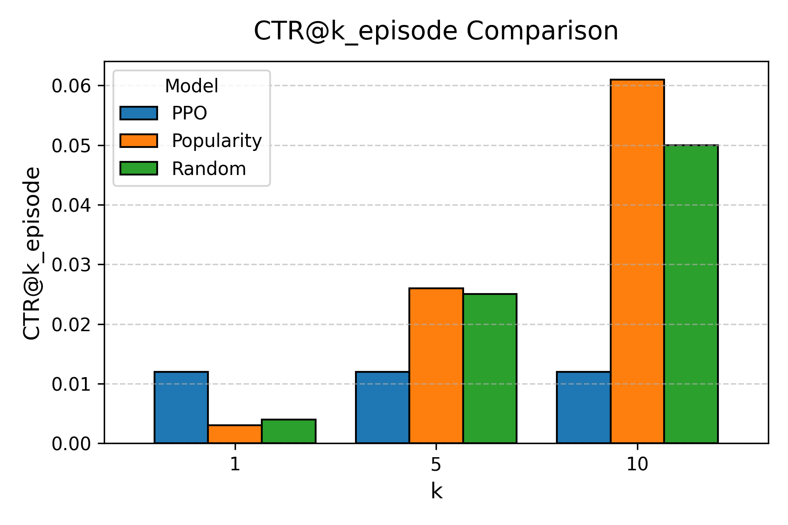
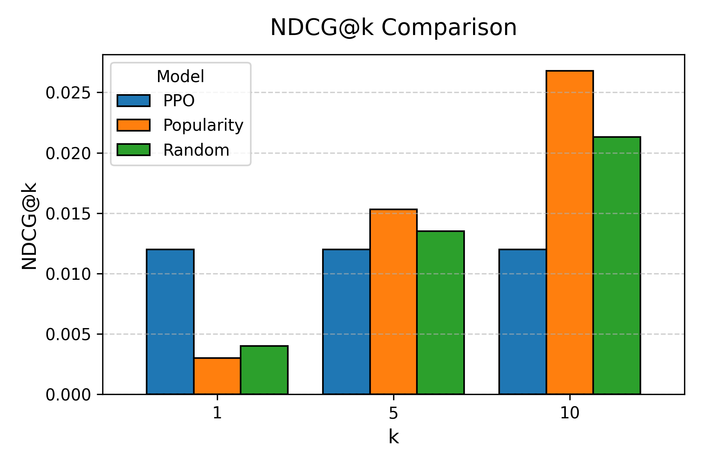

# Reinforcement Learning Book Recommender

This project implements a **Reinforcement Learning–based recommendation system** on the [Goodbooks-10k dataset], using **PPO** from `stable-baselines3`.  
We benchmark against **Random** and **Popularity-based** baselines, evaluating with CTR@k, Precision@k, Recall@k, and NDCG@k.

---

## Features
- **Environment**: Custom Gymnasium environment wrapping Goodbooks-10k ratings data.
- **RL Algorithm**: Proximal Policy Optimization (PPO).
- **Baselines**: Random & Popularity-based recommenders.
- **Metrics**: CTR@k, Precision@k, Recall@k, NDCG@k (per-episode and per-step true-hit).
- **Visualization**: Auto-generated bar plots for CTR@k and NDCG@k.

---

## Installation, Training, Evaluation, and Plotting
```bash
# Clone the repo
git clone https://github.com/kudos07/rl-book-recommender.git
cd rl-book-recommender

# Create and activate virtual environment
python -m venv .venv
.venv\Scripts\activate  # (Windows PowerShell)
# source .venv/bin/activate  # (Mac/Linux)

# Install dependencies
pip install --upgrade pip
pip install -r requirements.txt

# Download Goodbooks-10k dataset into artifacts/ directory
# Place ratings.csv, books.csv, and other files under artifacts/

# Train PPO model
python train.py

# Evaluate PPO, Random, and Popularity
python eval.py

# Generate plots
python plot_eval.py
```

---

## Results

**Per-step true-hit CTR@1**
- Random: **0.007**
- PPO: **0.025**  (~3.6× improvement over Random)

**Per-episode Metrics**

| Metric       | k  | PPO    | Popularity | Random |
|--------------|----|--------|------------|--------|
| CTR@k        | 1  | 0.0120 | 0.0030     | 0.0040 |
|              | 5  | 0.0120 | 0.0260     | 0.0250 |
|              | 10 | 0.0120 | 0.0610     | 0.0500 |
| NDCG@k       | 1  | 0.0120 | 0.0030     | 0.0040 |
|              | 5  | 0.0120 | 0.0153     | 0.0135 |
|              | 10 | 0.0120 | 0.0268     | 0.0213 |
| Precision@k  | 1  | 0.0120 | 0.0030     | 0.0040 |
|              | 5  | 0.0120 | 0.0052     | 0.0050 |
|              | 10 | 0.0120 | 0.0066     | 0.0053 |
| Recall@k     | 1  | 0.0081 | 0.0013     | 0.0033 |
|              | 5  | 0.0404 | 0.0156     | 0.0201 |
|              | 10 | 0.0808 | 0.0420     | 0.0416 |

**Plots**




---

## Hyperparameter Tuning

You can experiment with the following PPO parameters in `train.py` to optimize performance:

- **n_steps**: Number of steps to run per environment update (default: 128). Higher = more stable updates but slower.
- **batch_size**: Number of samples per gradient update (should divide `n_steps * n_envs`).
- **learning_rate**: Step size for the optimizer. Common range: `1e-5` to `3e-4`.
- **gamma**: Discount factor for future rewards. Higher values (0.95–0.999) emphasize long-term gains.
- **gae_lambda**: GAE parameter controlling bias-variance trade-off (default: 0.95).
- **clip_range**: PPO clipping parameter for policy update stability (default: 0.2).
- **ent_coef**: Entropy coefficient to encourage exploration (default: 0.0–0.01).
- **vf_coef**: Value function loss weight (default: 0.5).
- **max_grad_norm**: Gradient clipping for stability (default: 0.5).
- **policy_kwargs**:
  - `net_arch`: Neural network layer sizes (e.g., `[64, 64]` or `[256, 256]`).
  - `activation_fn`: Activation function (e.g., `nn.ReLU` or `nn.Tanh`).

---

## Tips for Better Results
- Increase `TOTAL_STEPS` in `train.py` to train longer.
- Normalize rewards for stability.
- Try `CnnPolicy` or `MlpPolicy` depending on your state representation.
- Run multiple seeds and average results for more reliable evaluation.
- Use GPU (`torch.cuda.is_available() == True`) for faster training.
